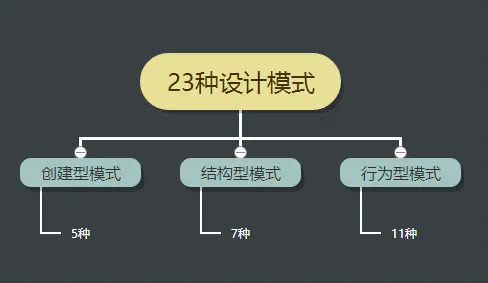
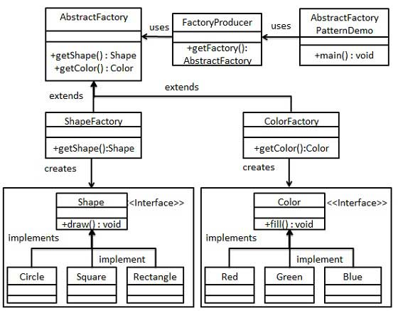
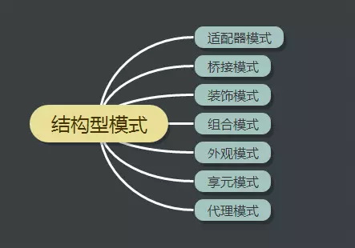

可靠性
重用性
更规范

二、7个设计原则
三、创建型模式(5种)
四、结构型模式(7种)
五、行为型模式(11种)

面向对象编程有七大原则，即经常提到的Design Pattern，提倡它的根本原因是为了代码复用，增加可维护性。
设计模式就是实现了这些原则，从而达到了代码复用、增加可维护性的目的。

单一职责原则（Single Responsibility Principle）
开闭原则
里氏替换原则
依赖倒置原则
接口隔离原则
迪米特原则（最少知道原则）
合成/聚合复用原则


设计模式是软件工程的基石，如同大厦的一块块砖石一样。



单一职责原则（Single Responsibility Principle）
```
定义是一个类，应该只有一个引起它变化的原因。
类变化的原因就是职责。

如果一个类承担的职责过多，就等于把这些职责耦合在一起了。
一个职责的变化可能会削弱或者抑制这个类完成其他职责的能力。

这种耦合会导致脆弱的设计，当发生变化时，设计会遭受到意想不到的破坏。
而如果想要避免这种现象的发生，就要尽可能的遵守单一职责原则。此原则的核心就是解耦和增强内聚性。

```

开闭原则 (Open Close Principle)

定义是软件实体（包括类、模块
、函数等）应该对于扩展时开放的，对于修改是封闭的。

**开闭原则是是面向对象设计中最重要的原则之一，其它很多的设计原则都是实现开闭原则的一种手段。**

里氏替换原则 (Liskov Substitution Principle)
```
是面向对象设计的基本原则之一。 

定义是任何基类可以出现的地方，子类一定可以出现。

LSP 是继承复用的基石，只有当派生类可以替换掉基类，且软件单位的功能不受到影响时，基类才能真正被复用，而派生类也能够在基类的基础上增加新的行为。

里氏替换原则是对开闭原则的补充。
实现开闭原则的关键步骤就是抽象化，而基类与子类的继承关系就是抽象化的具体实现，所以里氏替换原则是对实现抽象化的具体步骤的规范。
```

依赖倒置原则 (Dependence Inversion Principle)

```
这个原则是开闭原则的基础，

依赖倒置原则就是要求调用者和被调用者都依赖抽象，这样两者没有直接的关联和接触，在变动的时候，一方的变动不会影响另一方的变动。

依赖倒置强调了抽象的重要性，针对接口编程，依赖于抽象而不依赖于具体

```

接口隔离原则 (Interface Segregation Principle)
```
这个原则的意思是使用多个隔离的接口，比使用单个接口要好。目的就是降低类之间的耦合度，便于软件升级和维护。
```


最少知道原则(迪米特原则)
```
一个实体应当尽量少地与其他实体之间发生相互作用，使得系统功能模块相对独立。

通俗地说就是不要和陌生人说话，即一个对象应对其他对象有尽可能少的了解。

迪米特法则的初衷在于降低类之间的耦合。由于每个类尽量减少对其他类的依赖，因此，很容易使得系统的功能模块功能独立，相互之间不存在（或很少有）依赖关系。

```

合成/聚合复用（Composite Reuse Principle）

```
合成/聚合复用原则经常又叫做合成复用原则。

合成/聚合复用原则的潜台词是：我只是用你的方法，我们不一定是同类。
继承的耦合性更大，比如一个父类后来添加实现一个接口或者去掉一个接口，那子类可能会遭到毁灭性的编译错误，但如果只是组合聚合，只是引用类的方法，就不会有这种巨大的风险，同时也实现了复用。

```

创建型模式 ( 5种 )

创建型模式是指这些设计模式提供了一种在创建对象的同时隐藏创建逻辑的方式，而不是使用新的运算符直接实例化对象。这使得程序在判断针对某个给定实例需要创建哪些对象时更加灵活。


1.单例模式
定义
确保某一个类只有一个实例，并自行实例化向整个系统提供这个实例。

它主要是为了保证一个类仅有一个实例，这个类中自己提供一个返回实例的方法，方法中先判断系统是否已经有这个单例，如果有则返回，如果没有则创建。如果创建多个实例会消耗过多的资源或者某种类型的对象只应该有且只有一个时，应该考虑使用单例模式。

```java
// 单例

// 1. 饿汉式，(线程安全，调用效率高，但是不能延时加载)
// 如果没有使用到这个对象，那么会照成资源浪费
public class Singleton {
    private static Singleton instance = new Singleton();

    private Singleton {}

    public static Singleton getInstance() {
        return instance;
    }
}

// 2. 懒汉式，(线程安全，调用效率不高，但是能延时加载)：
public class Singleton {
     
    //类初始化时，不初始化这个对象(延时加载，真正用的时候再创建)
    private static Singleton instance;
     
    //构造器私有化
    private Singleton() {}
     
    //方法同步，调用效率低
    public static synchronized Singleton getInstance() {
        if(instance==null) {
            instance=new Singleton();
        }
        return instance;
    }
}


// 3.Double CheckLock实现单例：DCL也就是双重锁判断机制（由于JVM底层模型原因，偶尔会出问题，不建议使用）：
public class Singleton {
        private volatile static Singleton instance;
 
        private Singleton() {}
 
        public static Singleton newInstance() {
            if (instance == null) {
                synchronized (Singleton.class) {
                    if (instance == null) {
                        instance = new Singleton();
                    }
                }
            }
            return SingletonDemo5;
        }
}

// 4.静态内部类实现模式（线程安全，调用效率高，可以延时加载）
public class SingletonDemo3 {
     
    private static class SingletonClassInstance {
        private static final SingletonDemo3 instance = new SingletonDemo3();
    }
     
    private SingletonDemo3() {}
     
    public static SingletonDemo3 getInstance() {
        return SingletonClassInstance.instance;
    }
     
}

// 5.枚举类（线程安全，调用效率高，不能延时加载，可以天然的防止反射和反序列化调用）
public enum SingletonDemo4 {
     
    //枚举元素本身就是单例
    INSTANCE;
     
    //添加自己需要的操作
    public void singletonOperation(){     
    }
}

// -单例对象 占用资源少，不需要延时加载，枚举 好于 饿汉
// -单例对象 占用资源多，需要延时加载，静态内部类 好于 懒汉式

// 原理：
// 当一个Java类第一次被真正使用到的时候静态资源被初始化、Java类的加载和初始化过程都是线程安全的。所以，创建一个enum类型是线程安全的。

枚举的源码，枚举是怎么实现的，枚举为何是线程安全的，为什么用枚举实现的单例是最佳方式？
enum就和class一样，只是一个关键字，并不是一个类。
public enum t {
    SPRING,SUMMER,AUTUMN,WINTER；/**枚举的实例对象**/
}
反编译：
public final class T extends Enum {
    private T(String s, int i) {
        super(s, i);
    }
    public static T[] values() {
        T at[];
        int i;
        T at1[];
        System.arraycopy(at = ENUM$VALUES, 0, at1 = new T[i = at.length], 0, i);
        return at1;
    }
    public static T valueOf(String s) {
        return (T)Enum.valueOf(demo/T, s);
    }

    public static final T SPRING;
    public static final T SUMMER;
    public static final T AUTUMN;
    public static final T WINTER;
    private static final T ENUM$VALUES[];
    static {
        SPRING = new T("SPRING", 0);
        SUMMER = new T("SUMMER", 1);
        AUTUMN = new T("AUTUMN", 2);
        WINTER = new T("WINTER", 3);
        ENUM$VALUES = (new T[] {
            SPRING, SUMMER, AUTUMN, WINTER
        });
    }
}

public final class T extends Enum 说明：
该类是继承了Enum类的。
同时final关键字，这个类也是不能被继承的。
当使用enmu来定义一个枚举类型的时候，编译器会自动帮我们创建一个final类型的类继承Enum类,所以枚举类型不能被继承。

枚举类的属性和方法编译后，都被static修饰：
因为static类型的属性会在类被加载之后被初始化。
当一个Java类第一次被真正使用到的时候静态资源被初始化、Java类的加载和初始化过程都是线程安全的。
所以，创建一个enum类型是线程安全的。

一共有七种实现单例的方式。Effective Java作者Josh Bloch 提倡使用枚举的方式。
- 枚举写法简单
public enum EasySingleton{
    INSTANCE;
}
然后就可以通过EasySingleton.INSTANCE来访问。
- 枚举实例创建是thread-safe(线程安全的)
当一个Java类第一次被真正使用到的时候静态资源被初始化、Java类的加载和初始化过程都是线程安全的。所以，创建一个enum类型是线程安全的。
```

2.工厂方法模式
定义
定义一个用于创建对象的接口，让子类决定实例化哪一个类。

举例
工厂方法模式的典型例子，自行车分为山地自行车和公路自行车等，当需要买自行车时，我们直接去自行车厂里告诉厂长我们需要的自行车即可。

```java
// 1、定义一个接口自行车，Bike。
public interface Bike {
    void ride();
}

// 2、定义实现类山地自行车，MBike
public class MBike implements Bike{ 
    @Override 
    public void draw() { 
           System.out.println("MBike Rides... "); 
    }
}

// 3、定义实现类公路自行车，RBike
public class RBike implements Bike{ 
    @Override 
    public void draw() { 
           System.out.println("RBike Rides... "); 
    }
}

// 4、工厂类，负责创建对象
public class BikeFactory {
   //使用 getShape 方法获取形状类型的对象
   public Bike getBike(String bikeType){

      if(bikeType == null){
         return null;
      }     

      if(bikeType.equalsIgnoreCase("MBike")){
         return new MBike();
      }else if(shapeType.equalsIgnoreCase("RBike")){
         return new RBike();
      }

      return null;
   }
}

// 5、子类决定实例化哪一个类
public class FactoryPatternDemo {
   public static void main(String[] args) {

      BikeFactory bikeFactory = new BikeFactory();

      Bike bike1 = bikeFactory.getBike("MBike");
      bike1.ride();

      Bike bike2= bikeFactory.getBike("RBike");
      bike2.ride();
   }
}

```

3.抽象工厂模式
定义
提供一个创建一系列相关或相互依赖对象的接口，而无需指定它们具体的类。

抽象工厂模式主要解决接口选择的问题，典型例子是手机和电脑问题，假设抽象产品1是手机，具体产品是Android手机和iOS手机，抽象产品2是电脑，具体产品是Windows电脑和Mac电脑，抽象工厂是同时生产手机和电脑的公司，具体工厂是联想公司和苹果公司。

抽象工厂的优点是当一个产品族中的多个对象被设计成一起工作时，它能保证客户端始终只使用同一个产品族中的对象。缺点是产品族扩展非常困难，要增加一个系列的某一产品，既要在抽象工厂里加代码，又要在具体工厂里加代码。

抽象工厂模式（Abstract Factory Pattern）是围绕一个超级工厂创建其他工厂。该超级工厂又称为其他工厂的工厂。这种类型的设计模式属于创建型模式，它提供了一种创建对象的最佳方式。

详情 https://www.runoob.com/design-pattern/abstract-factory-pattern.html

在抽象工厂模式中，接口是负责创建一个相关对象的工厂，不需要显式指定它们的类。每个生成的工厂都能按照工厂模式提供对象。

**缺点：产品族扩展非常困难，要增加一个系列的某一产品，既要在抽象的 Creator 里加代码，又要在具体的里面加代码。**



```java
步骤 1
为形状创建一个接口。

Shape.java
public interface Shape {
   void draw();
}
步骤 2
创建实现接口的实体类。

Rectangle.java

Rectangle.java
public class Rectangle implements Shape {
 
   @Override
   public void draw() {
      System.out.println("Inside Rectangle::draw() method.");
   }
}
Square.java
public class Square implements Shape {
 
   @Override
   public void draw() {
      System.out.println("Inside Square::draw() method.");
   }
}
Circle.java
public class Circle implements Shape {
 
   @Override
   public void draw() {
      System.out.println("Inside Circle::draw() method.");
   }
}
步骤 3
为颜色创建一个接口。

Color.java
public interface Color {
   void fill();
}
步骤4
创建实现接口的实体类。

Red.java
public class Red implements Color {
 
   @Override
   public void fill() {
      System.out.println("Inside Red::fill() method.");
   }
}
Green.java
public class Green implements Color {
 
   @Override
   public void fill() {
      System.out.println("Inside Green::fill() method.");
   }
}
Blue.java
public class Blue implements Color {
 
   @Override
   public void fill() {
      System.out.println("Inside Blue::fill() method.");
   }
}
步骤 5
为 Color 和 Shape 对象创建抽象类来获取工厂。

AbstractFactory.java
public abstract class AbstractFactory {
   public abstract Color getColor(String color);
   public abstract Shape getShape(String shape) ;
}
步骤 6
创建扩展了 AbstractFactory 的工厂类，基于给定的信息生成实体类的对象。

ShapeFactory.java
public class ShapeFactory extends AbstractFactory {
    
   @Override
   public Shape getShape(String shapeType){
      if(shapeType == null){
         return null;
      }        
      if(shapeType.equalsIgnoreCase("CIRCLE")){
         return new Circle();
      } else if(shapeType.equalsIgnoreCase("RECTANGLE")){
         return new Rectangle();
      } else if(shapeType.equalsIgnoreCase("SQUARE")){
         return new Square();
      }
      return null;
   }
   
   @Override
   public Color getColor(String color) {
      return null;
   }
}
ColorFactory.java
public class ColorFactory extends AbstractFactory {
    
   @Override
   public Shape getShape(String shapeType){
      return null;
   }
   
   @Override
   public Color getColor(String color) {
      if(color == null){
         return null;
      }        
      if(color.equalsIgnoreCase("RED")){
         return new Red();
      } else if(color.equalsIgnoreCase("GREEN")){
         return new Green();
      } else if(color.equalsIgnoreCase("BLUE")){
         return new Blue();
      }
      return null;
   }
}
步骤 7
创建一个工厂创造器/生成器类，通过传递形状或颜色信息来获取工厂。

FactoryProducer.java
public class FactoryProducer {
   public static AbstractFactory getFactory(String choice){
      if(choice.equalsIgnoreCase("SHAPE")){
         return new ShapeFactory();
      } else if(choice.equalsIgnoreCase("COLOR")){
         return new ColorFactory();
      }
      return null;
   }
}
步骤 8
使用 FactoryProducer 来获取 AbstractFactory，通过传递类型信息来获取实体类的对象。

AbstractFactoryPatternDemo.java
public class AbstractFactoryPatternDemo {
   public static void main(String[] args) {
 
      //获取形状工厂
      AbstractFactory shapeFactory = FactoryProducer.getFactory("SHAPE");
 
      //获取形状为 Circle 的对象
      Shape shape1 = shapeFactory.getShape("CIRCLE");
 
      //调用 Circle 的 draw 方法
      shape1.draw();
 
      //获取形状为 Rectangle 的对象
      Shape shape2 = shapeFactory.getShape("RECTANGLE");
 
      //调用 Rectangle 的 draw 方法
      shape2.draw();
      
      //获取形状为 Square 的对象
      Shape shape3 = shapeFactory.getShape("SQUARE");
 
      //调用 Square 的 draw 方法
      shape3.draw();
 
      //获取颜色工厂
      AbstractFactory colorFactory = FactoryProducer.getFactory("COLOR");
 
      //获取颜色为 Red 的对象
      Color color1 = colorFactory.getColor("RED");
 
      //调用 Red 的 fill 方法
      color1.fill();
 
      //获取颜色为 Green 的对象
      Color color2 = colorFactory.getColor("Green");
 
      //调用 Green 的 fill 方法
      color2.fill();
 
      //获取颜色为 Blue 的对象
      Color color3 = colorFactory.getColor("BLUE");
 
      //调用 Blue 的 fill 方法
      color3.fill();
   }
}
步骤 9
执行程序，输出结果：

Inside Circle::draw() method.
Inside Rectangle::draw() method.
Inside Square::draw() method.
Inside Red::fill() method.
Inside Green::fill() method.
Inside Blue::fill() method.
```

4.建造者模式
定义
将一个复杂的构建与其表示相分离，使得同样的构建过程可以创建不同的表示。

建造者模式主要解决在软件系统中一个复杂对象的创建工作。通常一个复杂对象是由各个部分的子对象用一定的算法构成，由于需求的变化，这个复杂对象的各个部分经常面临着剧烈的变化，但是将它们组合在一起的算法却相对稳定。

建造者模式的一个典型例子是Android中的AlertDialog的构建过程。还有个例子是计算机的组装，计算机是个复杂的对象，它是有很多零件组装而成，显示器、操作系统，鼠标等，通过创建Builder接口来控制零件的组装过程，这样当组件发生变化时，虽然经过同样的构建过程，但是最后得到的结果不同

详情 https://www.runoob.com/design-pattern/builder-pattern.html


```java
步骤 1
创建一个表示食物条目和食物包装的接口。

Item.java
public interface Item {
   public String name();
   public Packing packing();
   public float price();    
}
Packing.java
public interface Packing {
   public String pack();
}
步骤 2
创建实现 Packing 接口的实体类。

Wrapper.java
public class Wrapper implements Packing {
 
   @Override
   public String pack() {
      return "Wrapper";
   }
}
Bottle.java
public class Bottle implements Packing {
 
   @Override
   public String pack() {
      return "Bottle";
   }
}
步骤 3
创建实现 Item 接口的抽象类，该类提供了默认的功能。

Burger.java
public abstract class Burger implements Item {
 
   @Override
   public Packing packing() {
      return new Wrapper();
   }
 
   @Override
   public abstract float price();
}
ColdDrink.java
public abstract class ColdDrink implements Item {
 
    @Override
    public Packing packing() {
       return new Bottle();
    }
 
    @Override
    public abstract float price();
}
步骤 4
创建扩展了 Burger 和 ColdDrink 的实体类。

VegBurger.java
public class VegBurger extends Burger {
 
   @Override
   public float price() {
      return 25.0f;
   }
 
   @Override
   public String name() {
      return "Veg Burger";
   }
}
ChickenBurger.java
public class ChickenBurger extends Burger {
 
   @Override
   public float price() {
      return 50.5f;
   }
 
   @Override
   public String name() {
      return "Chicken Burger";
   }
}
Coke.java
public class Coke extends ColdDrink {
 
   @Override
   public float price() {
      return 30.0f;
   }
 
   @Override
   public String name() {
      return "Coke";
   }
}
Pepsi.java
public class Pepsi extends ColdDrink {
 
   @Override
   public float price() {
      return 35.0f;
   }
 
   @Override
   public String name() {
      return "Pepsi";
   }
}
步骤 5
创建一个 Meal 类，带有上面定义的 Item 对象。

Meal.java
import java.util.ArrayList;
import java.util.List;
 
public class Meal {
   private List<Item> items = new ArrayList<Item>();    
 
   public void addItem(Item item){
      items.add(item);
   }
 
   public float getCost(){
      float cost = 0.0f;
      for (Item item : items) {
         cost += item.price();
      }        
      return cost;
   }
 
   public void showItems(){
      for (Item item : items) {
         System.out.print("Item : "+item.name());
         System.out.print(", Packing : "+item.packing().pack());
         System.out.println(", Price : "+item.price());
      }        
   }    
}
步骤 6
创建一个 MealBuilder 类，实际的 builder 类负责创建 Meal 对象。

MealBuilder.java
public class MealBuilder {
 
   public Meal prepareVegMeal (){
      Meal meal = new Meal();
      meal.addItem(new VegBurger());
      meal.addItem(new Coke());
      return meal;
   }   
 
   public Meal prepareNonVegMeal (){
      Meal meal = new Meal();
      meal.addItem(new ChickenBurger());
      meal.addItem(new Pepsi());
      return meal;
   }
}
步骤 7
BuiderPatternDemo 使用 MealBuider 来演示建造者模式（Builder Pattern）。

BuilderPatternDemo.java
public class BuilderPatternDemo {
   public static void main(String[] args) {
      MealBuilder mealBuilder = new MealBuilder();
 
      Meal vegMeal = mealBuilder.prepareVegMeal();
      System.out.println("Veg Meal");
      vegMeal.showItems();
      System.out.println("Total Cost: " +vegMeal.getCost());
 
      Meal nonVegMeal = mealBuilder.prepareNonVegMeal();
      System.out.println("\n\nNon-Veg Meal");
      nonVegMeal.showItems();
      System.out.println("Total Cost: " +nonVegMeal.getCost());
   }
}
步骤 8
执行程序，输出结果：

Veg Meal
Item : Veg Burger, Packing : Wrapper, Price : 25.0
Item : Coke, Packing : Bottle, Price : 30.0
Total Cost: 55.0


Non-Veg Meal
Item : Chicken Burger, Packing : Wrapper, Price : 50.5
Item : Pepsi, Packing : Bottle, Price : 35.0
Total Cost: 85.5

```


5.原型模式

定义
用原型实例指定创建对象的种类，并且通过拷贝这些原型创建新的对象。

简介
原型模式不难理解，它主要是用在实例创建的时候，因为有的时候我们通过new创建一个对象时可能成本过高，这时我们可以考虑直接通过直接克隆实例快速创建对象。克隆后的实例与原实例内部属性一致。原型模式需要注意一个深拷贝和浅拷贝的问题

详情 https://www.runoob.com/design-pattern/prototype-pattern.html


结构型模式(7种)

结构型模式关注类和对象的组合。继承的概念被用来组合接口和定义组合对象获得新功能的方式。



1.适配器模式

定义
将一个类的接口转换成另外一个客户希望的接口。适配器模式使得原本由于接口不兼容而不能一起工作的那些类可以一起工作。

简介
适配器模式包括两种类型，类适配器模式和对象适配器模式。这里主要介绍对象适配器模式，因为它更灵活。适配器模式中主要有三个部分，Target、Adapter和Adaptee，其中Target是目标角色，Adaptee是需要被转换的对象，Adapter就是适配器。例如，现在有个手机充电电压是5v，而插座电压是220v，这时我们可以把充电器看成是Adapter，它将电压进行转化最后得到结果。

```java
// Target 目标接口
public interface Volt5 {
    public int getVolt5();
}

// Adaptee 需要被转换的对象
public class Volt220 {
    public int getVolt220() {
        return 220;
    }
}

//Adapter 适配器 
public class VoltAdapter implements Volt5 {

    Volt220 mVolt220;

    public VoltAdapter(Volt220 adaptee) {
        mVolt220 = adaptee;
    }

    public int getVolt220() {
        return 220;
    }

    @Override
    public int getVolt5() {
        return 5;
    }
}
```

https://www.cnblogs.com/wangjq/archive/2012/07/09/2582485.html

https://www.runoob.com/design-pattern/adapter-pattern.html


2.桥接模式

定义
将抽象部分与实现部分分离，使它们都可以独立的变化。

-简介

在软件系统中，某些类型由于自身的逻辑，它具有两个或多个维度的变化，那么如何应对这种“多维度的变化”？这就要使用桥接模式。桥接模式需要重点理解的抽象部分，实现部分，脱耦。一个典型的例子是咖啡加糖问题，抽象部分有Coffee，其下有LargeCoffee，SmallCoffee，实现部分是CoffeeAdd，其下有Sugar，Normal，抽象类Coffee中引用CoffeeAdd，这样CoffeeAdd其实就是一个桥接。

https://www.runoob.com/design-pattern/bridge-pattern.html

3.装饰模式

定义
动态地给一个对象添加一些额外的职责。就增加功能来说，Decorator模式相比生成子类更为灵活。

简介
装饰模式是作为现有的类的一个包装，它允许向一个现有的对象添加新的功能，同时又不改变其结构。这种模式创建了一个装饰类，用来包装原有的类，并在保持类方法签名完整性的前提下，提供了额外的功能。装饰模式主要是装饰器类Decorator的设计，它对指定对象进行装饰。

https://www.runoob.com/design-pattern/decorator-pattern.html

4.组合模式

定义
将对象组合成树形结构以表示“部分-整体”的层次结构，使得用户对单个对象和组合对象的使用具有一致性。

简介
组合模式理解起来相对简单，典型的例子就是假设公司A，里面有不同的部门，不同的部分下有不同的员工，这样一个部门下的所有员工组合成了一个部门，所有部门组合成了整个公司。

5.外观模式

定义
为子系统中的一组接口提供一个一致的界面，外观模式定义了一个高层接口，这个接口使得这一子系统更加容易使用。

简介
外观模式的一个典型例子是去医院看病，挂号、门诊、划价、取药，让患者或患者家属觉得很复杂，如果有提供接待人员，只让接待人员来处理，就很方便。

6.享元模式

定义
运用共享技术有效地支持大量细粒度的对象。

简介
在有大量对象时，有可能会造成内存溢出，我们把其中共同的部分抽象出来，如果有相同的业务请求，直接返回在内存中已有的对象，避免重新创建。


7.代理模式

定义
为其他对象提供一种代理以控制对这个对象的访问。

简介
代理模式主要解决在直接访问对象时带来的问题。举个例子，猪八戒去找高翠兰结果是孙悟空变的，可以这样理解：把高翠兰的外貌抽象出来，高翠兰本人和孙悟空都实现了这个接口，猪八戒访问高翠兰的时候看不出来这个是孙悟空，所以说孙悟空是高翠兰代理类。


行为型模式 ( 11种 )

这些设计模式特别关注对象之间的通信。


1.模板方法模式

定义
一个操作中的算法的框架，而将一些步骤延迟到子类中，使得子类可以不改变一个算法的结构即可重定义该算法的某些特定步骤。

例子
模板方法模式一个典型例子就是Android中的异步任务类AsyncTask，它对异步任务的执行进行了流程封装，子类继承它时，只需在指定的流程中实现具体的操作即可。


2.命令模式

定义
将一个请求封装为一个对象，从而可用不同的请求对客户进行参数化；对请求排队或记录请求日志，以及支持可取消的操作

简介
命令模式主要是通过调用者调用接受者执行命令，这个模式中需要理解的是三个角色：(1) Receiver 真正的命令执行对象 (2) Command 持有一个对Receiver的引用，调用Receiver的相关方法。(3) Invoker 请求者，持有一个对Command的引用，调用Command的方法执行具体命令。

3.迭代器模式

定义
提供一种方法顺序访问一个聚合对象中各个元素, 而又不需暴露该对象的内部表示。

简介
在Java集合框架中我们知道对于一个指定的集合类，我们可以使用一个特定的Iterator迭代器来对集合中的所有元素进行遍历。这样结合来看，迭代器模式很好理解了。

4.观察者模式

定义
定义对象间的一种一对多的依赖关系，当一个对象的状态发生改变时，所有依赖于它的对象都得到通知并被自动更新。

简介
观察者模式可以结合Android中的ListView来理解，ListView关联的适配器Adapter在数据发生变化时会通过notifyDataSetChanged()方法来通知界面刷新。

https://www.runoob.com/design-pattern/observer-pattern.html

5.中介者模式

定义
用一个中介对象来封装一系列的对象交互。中介者使各对象不需要显式地相互引用，从而使其耦合松散，而且可以独立地改变它们之间的交互。

简介
中介者模式的典型例子就是未加入 WTO 之前各个国家相互贸易，结构复杂，大家都加入WTO后是各个国家通过 WTO 来互相贸易，变得规范。

6.备忘录模式

定义
在不破坏封装性的前提下，捕获一个对象的内部状态，并在该对象之外保存这个状态。这样以后就可将该对象恢复到保存的状态。

简介
备忘录模式的典型例子就是git版本管理工具，它帮我们保存了每次提交后的项目状态，在必要的时候我们可以回退到指定的版本中。

7.解释器模式

定义
给定一个语言，定义它的文法的一种表示，并定义一个解释器，这个解释器使用该表示来解释语言中的句子。

简介
解释器的典型例子是在编译原理中的应用，如果一种特定类型的问题发生的频率足够高，那么可能就值得将该问题的各个实例表述为一个简单语言中的句子。这样就可以构建一个解释器，该解释器通过解释这些句子来解决该问题。


8.状态模式

定义
允许一个对象在其内部状态改变时改变它的行为。对象看起来似乎修改了它的类。

简介
状态模式主要解决对象的行为依赖于它的状态（属性），并且可以根据它的状态改变而改变它的相关行为。典型的例子是一个人在不同的状态下完成一件事的结果可能是不同的。

9.策略模式

定义
定义一系列的算法,把它们一个个封装起来, 并且使它们可相互替换。本模式使得算法可独立于使用它的客户而变化。

简介
从策略模式的定义可以看到它主要是将算法和客户独立开，一个典型的例子是排序算法，我们给定一个数组，输出排序后的结果，但是过程中我们可以采取不同的排序算法，这些算法其实就是策略。

10.责任链模式

定义
使多个对象都有机会处理请求，从而避免请求的发送者和接收者之间的耦合关系。将这些对象连成一条链，并沿着这条链传递该请求，直到有一个对象处理它为止。

简介
责任链模式，避免请求发送者与接收者耦合在一起，让多个对象都有可能接收请求，将这些对象连接成一条链，并且沿着这条链传递请求，直到有对象处理它为止。


11.访问者模式

定义
封装一些作用于某种数据结构中的各元素的操作。它使你可以在不改变各元素的类的前提下定义作用于这些元素的新操作。

简介
访问者模式是一种将数据操作和数据结构分离的设计模式，它通常使用在对象结构比较稳定，但是经常需要在此对象结构上定义新的操作，或者需要对一个对象结构中的对象进行很多不同的并且不相关的操作，而需要避免让这些操作"污染"这些对象的类，使用访问者模式将这些封装到类中。


