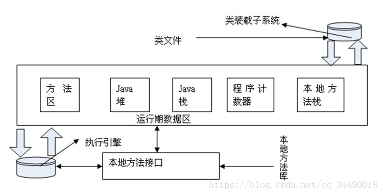
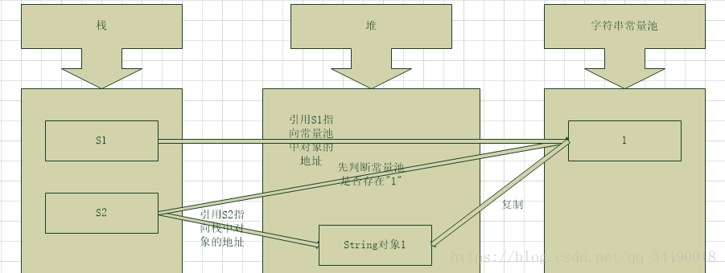
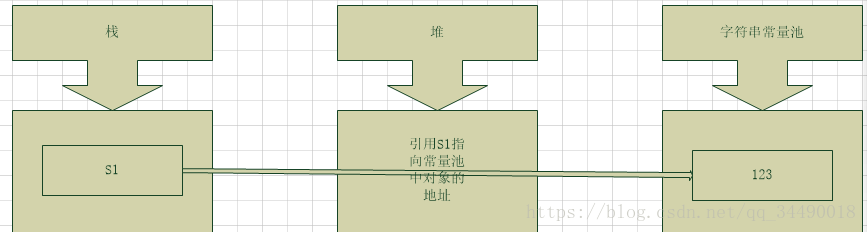
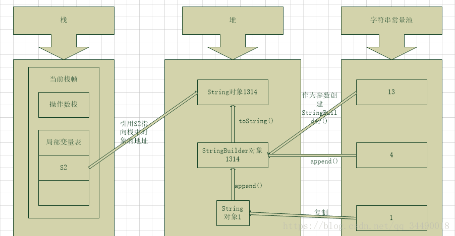
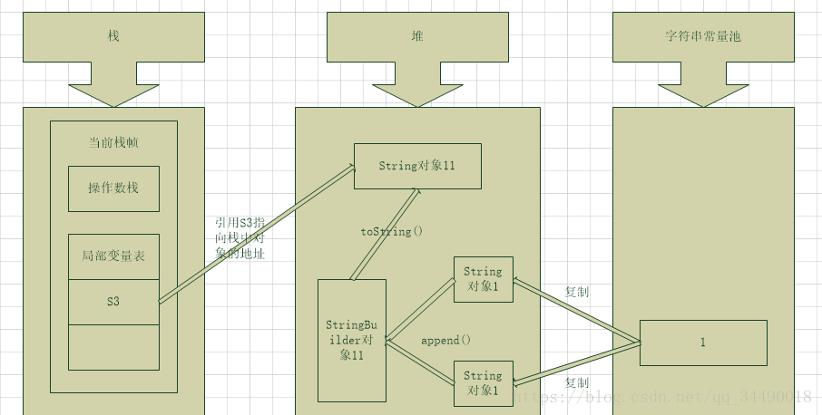
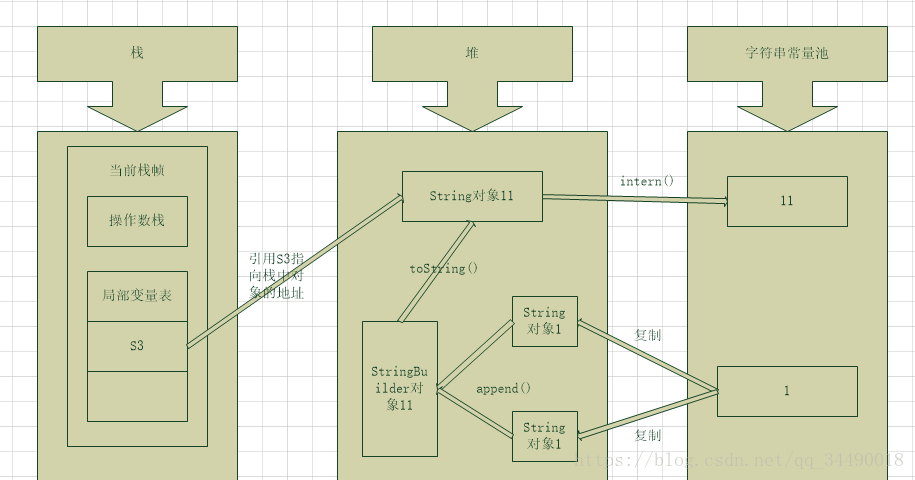
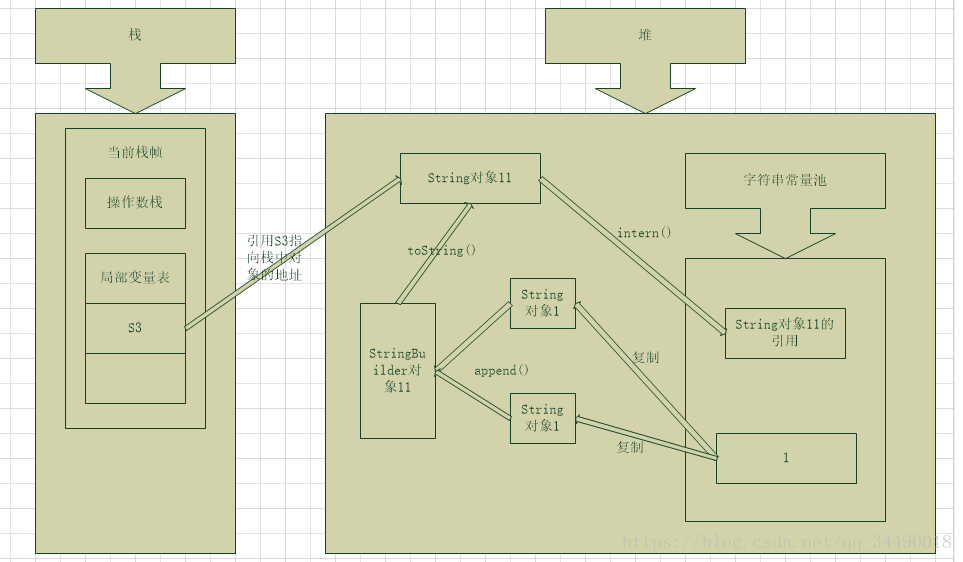

首先，String的底层实现是char[]数组，数组是引用类型，所以String肯定是引用类型。
但在某些时候，表现出了值类型的特性。

8大基本类型是值类型：
short int long 
byte char
float double
boolean

例子：
```java
package com.ntools.hw.springBootDemo.test.strings;

/**
 * 测试String类会表现出值类型的特性吗？
 */
public class MainActivity {
    public static void main(String[] args) {
        System.out.println(test1());
        System.out.println(test2());
        System.out.println(test3());
    }

    static boolean test1() {
        String a = "123";
        String b = "123";
        return a == b; // true
    }

    static boolean test2() {
        String a = new String("123");
        String b = new String("123");
        return a == b; // false
    }

    static boolean test3() {
        String a = "123";
        String b = new String("123");
        return a == b; // false
    }
}
```

分析
String s = "123";

首先s是String类型的变量，分配在线程栈中。
“123”对象分配在堆中。
字符串常量池中保存了指向“123”对象s的指针（地址）。
变量s的值和常量之中保存的“123”对象的指针相同。

1. 首先，常量池中查找“123”对象的指针（地址）；
2. 如果在常量池中未能找到“123”的指针，则在堆中分配“123”对象的内存空间，把对象的内存地址保存在常量池中，
3. 把这个地址赋值给变量s
4. 如果在常量池中找到“123”对象的指针，说明堆中已经存在“123”对象，因为常量表示一个不可变的对象，所以，没有必要再创建新的实例，直接把常量池中的指针内容赋值给s。
5. 而new String，实际上涉及到两个String实体。
6. “123”对象在堆中存在一个实体，并且在常量池中存在一个指向“123”的指针，而new String()会在堆中创建一个新的String实体，并深度拷贝“123”的内容，并返回新的String实体的地址，赋值给s。



Java栈（线程私有数据区）：
```
每个Java虚拟机线程都有自己的Java虚拟机栈
Java虚拟机栈用来存放栈帧
每个方法被执行的时候都会同时创建一个栈帧（Stack Frame）
用于存储局部变量表、操作栈、动态链接、方法出口等信息
每一个方法被调用直至执行完成的过程，就对应着一个栈帧在虚拟机栈中从入栈到出栈的过程。
```

Java堆（线程共享数据区）：
```
在虚拟机启动时创建
此内存区域的唯一目的就是存放对象实例
几乎所有的对象实例都在这里分配
```

方法区（线程共享数据区）：
```
方法区在虚拟机启动的时候被创建
存储了每一个类的结构信息
例如运行时常量池、字段和方法数据、构造函数和普通方法的字节码内容、还包括在类、实例、接口初始化时用到的特殊方法
在JDK8之前永久代是方法区的一种实现，而JDK8元空间替代了永久代，永久代被移除，也可以理解为元空间是方法区的一种实现。
```

常量池（线程共享数据区）：
```
常量池常被分为两大类：静态常量池和运行时常量池。
静态常量池也就是Class文件中的常量池，存在于Class文件中。
运行时常量池（Runtime Constant Pool）是方法区的一部分，存放一些运行时常量数据。
```

字符串常量池存在运行时常量池之中（在JDK7之前存在运行时常量池之中，在JDK7已经将其转移到堆中）。

字符串常量池的存在使JVM提高了性能和减少了内存开销。

**这段感觉是对的**
```text
使用字符串常量池，每当我们使用字面量（String s=”1”;）创建字符串常量时，JVM会首先检查字符串常量池，如果该字符串已经存在常量池中，那么就将此字符串对象的地址赋值给引用s（引用s在Java栈中）。如果字符串不存在常量池中，就会实例化该字符串并且将其放到常量池中，并将此字符串对象的地址赋值给引用s（引用s在Java栈中）。

使用字符串常量池，每当我们使用关键字new（String s=new String(”1”);）创建字符串常量时，JVM会首先检查字符串常量池，如果该字符串已经存在常量池中，那么不再在字符串常量池创建该字符串对象，而直接堆中复制该对象的副本，然后将堆中对象的地址赋值给引用s，如果字符串不存在常量池中，就会实例化该字符串并且将其放到常量池中，然后在堆中复制该对象的副本，然后将堆中对象的地址赋值给引用s。

```

参考api说明：
```
java.lang.String.String(String original)
“初始化一个新创建的字符串对象，以便它表示与参数相同的字符序列；换句话说，新创建的字符串是参数字符串的副本。除非需要显式的原始副本，否则使用此构造函数是不必要的，因为字符串是不可变的。”
```

由于String字符串的不可变性我们可以十分肯定常量池中一定不存在两个相同的字符串。

javap -c StringDemo.class
javap -verbose StringDemo.class


String s1=”1”;
String s2=new String(“1”);




```text
s1使用””引号（也是平时所说的字面量）创建字符串，
在编译期的时候就对常量池进行判断是否存在该字符串，
如果存在则不创建直接返回对象的引用；
如果不存在，则先在常量池中创建该字符串实例再返回实例的引用给s1。

s2使用关键词new创建字符串，
JVM会首先检查字符串常量池，
如果该字符串已经存在常量池中，那么不再在字符串常量池创建该字符串对象，而直接堆中复制该对象的副本，然后将堆中对象的地址赋值给引用s2，
如果字符串不存在常量池中，就会实例化该字符串并且将其放到常量池中，然后在堆中复制该对象的副本，然后将堆中对象的地址赋值给引用s2

```

String s1=”1”+”2”+”3”;


```
使用包含常量的字符串连接创建是也是常量，编译期就能确定了，直接入字符串常量池，当然同样需要判断是否已经存在该字符串。
```


String s2=”1”+”3”+new String(“1”)+”4”;


```
当使用“+”连接字符串中含有变量时，也是在运行期才能确定的。首先连接操作最开始时如果都是字符串常量，编译后将尽可能多的字符串常量连接在一起，形成新的字符串常量参与后续的连接（可通过反编译工具jd-gui进行查看）。

接下来的字符串连接是从左向右依次进行，对于不同的字符串，首先以最左边的字符串为参数创建StringBuilder对象（可变字符串对象），然后依次对右边进行append操作，最后将StringBuilder对象通过toString()方法转换成String对象（注意：中间的多个字符串常量不会自动拼接）。

实际上的实现过程为：String s2=new StringBuilder(“13”).append(new String(“1”)).append(“4”).toString();

当使用+进行多个字符串连接时，实际上是产生了一个StringBuilder对象和一个String对象

```

String s3=new String(“1”)+new String(“1”);


String.intern()解析：
```
String.intern()是一个Native方法，
底层调用C++的 StringTable::intern 方法，

源码注释：当调用 intern 方法时，如果常量池中已经该字符串，则返回池中的字符串；否则将此字符串添加到常量池中，并返回字符串的引用。
```

```java
String s3 = new String("1") + new String("1");
System.out.println(s3 == s3.intern());

jdk6 : false
jdk7 : true
```

jdk6:


我们都知道JDK6中的常量池是放在永久代的，永久代和Java堆是两个完全分开的区域。而存在变量使用“+”连接而来的的对象存在Java堆中，且并未将对象存于常量池中，当调用 intern 方法时，如果常量池中已经该字符串，则返回池中的字符串；否则将此字符串添加到常量池中，并返回字符串的引用。所以结果为false。


jdk7:


JDK7中，字符串常量池已经被转移至Java堆中，开发人员也对intern 方法做了一些修改。因为字符串常量池和new的对象都存于Java堆中，为了优化性能和减少内存开销，当调用 intern 方法时，如果常量池中已经存在该字符串，则返回池中字符串；否则直接存储堆中的引用，也就是字符串常量池中存储的是指向堆里的对象。所以结果为true。

关于equals和== ：

（1）对于==，如果作用于基本数据类型的变量（byte,short,char,int,long,float,double,boolean ），则直接比较其存储的"值"是否相等；如果作用于引用类型的变量（String），则比较的是所指向的对象的地址（即是否指向同一个对象）。

（2）equals方法是基类Object中的方法，因此对于所有的继承于Object的类都会有该方法。在Object类中，equals方法是用来比较两个对象的引用是否相等。

（3）对于equals方法，注意：equals方法不能作用于基本数据类型的变量。如果没有对equals方法进行重写，则比较的是引用类型的变量所指向的对象的地址；而String类对equals方法进行了重写，用来比较指向的字符串对象所存储的字符串是否相等。其他的一些类诸如Double，Date，Integer等，都对equals方法进行了重写用来比较指向的对象所存储的内容是否相等。


```java
/**
         * 情景一：字符串池
          * JAVA虚拟机(JVM)中存在着一个字符串池，其中保存着很多String对象;
         * 并且可以被共享使用，因此它提高了效率。
         * 由于String类是final的，它的值一经创建就不可改变。
         * 字符串池由String类维护，我们可以调用intern()方法来访问字符串池。  
         */  

        String s1 = "abc";     

        //↑ 在字符串池创建了一个对象  

        String s2 = "abc";     

        //↑ 字符串pool已经存在对象“abc”(共享),所以创建0个对象，累计创建一个对象  

        System.out.println("s1 == s2 : "+(s1==s2));    // true

        //↑ true 指向同一个对象，  

        System.out.println("s1.equals(s2) : " + (s1.equals(s2))); // true    

        //↑ true  值相等  

        //↑------------------------------------------------------over  

        /**
         * 情景二：关于new String("")
         *  
         */  

        String s3 = new String("abc");  

        //↑ 创建了两个对象，一个存放在字符串池中，一个存在与堆区中；  

        //↑ 还有一个对象引用s3存放在栈中  

        String s4 = new String("abc");  

        //↑ 字符串池中已经存在“abc”对象，所以只在堆中创建了一个对象  

        System.out.println("s3 == s4 : "+(s3==s4));  // false

        //↑false   s3和s4栈区的地址不同，指向堆区的不同地址；  

        System.out.println("s3.equals(s4) : "+(s3.equals(s4)));  // true

        //↑true  s3和s4的值相同  

        System.out.println("s1 == s3 : "+(s1==s3));  // false

        //↑false 存放的地区多不同，一个栈区，一个堆区  

        System.out.println("s1.equals(s3) : "+(s1.equals(s3)));  // true

        //↑true  值相同  

        //↑------------------------------------------------------over  

        /**
         * 情景三：  
         * 由于常量的值在编译的时候就被确定(优化)了。
         * 在这里，"ab"和"cd"都是常量，因此变量str3的值在编译时就可以确定。
         * 这行代码编译后的效果等同于： String str3 = "abcd";
         */  

        String str1 = "ab" + "cd";  //1个对象  

        String str11 = "abcd";   

        System.out.println("str1 = str11 : "+ (str1 == str11));  // true

        //↑------------------------------------------------------over  

        /**
         * 情景四：  
         * 局部变量str2,str3存储的是存储两个拘留字符串对象(intern字符串对象)的地址。
         *  
         * 第三行代码原理(str2+str3)：
         * 运行期JVM首先会在堆中创建一个StringBuilder类，
         * 同时用str2指向的拘留字符串对象完成初始化，
         * 然后调用append方法完成对str3所指向的拘留字符串的合并，
         * 接着调用StringBuilder的toString()方法在堆中创建一个String对象，
         * 最后将刚生成的String对象的堆地址存放在局部变量str4中。
         *  
         * 而str5存储的是字符串池中"abcd"所对应的拘留字符串对象的地址。
         * str4与str5地址当然不一样了。
         *  
         * 内存中实际上有五个字符串对象：
         *       三个拘留字符串对象、一个String对象和一个StringBuilder对象。
         */  

        String str2 = "ab";  //1个对象  

        String str3 = "cd";  //1个对象                                         

        String str4 = str2+str3;                                        

        String str5 = "abcd";    

        System.out.println("str4 = str5 : " + (str4==str5)); // false  

        //↑------------------------------------------------------over  

        /**
         * 情景五：
         *  JAVA编译器对string + 基本类型/常量 是当成常量表达式直接求值来优化的。
         *  运行期的两个string相加，会产生新的对象的，存储在堆(heap)中
         */  

        String str6 = "b";  

        String str7 = "a" + str6;  

        String str67 = "ab";  

        System.out.println("str7 = str67 : "+ (str7 == str67));  // false

        //↑str6为变量，在运行期才会被解析。  

        final String str8 = "b";  

        String str9 = "a" + str8;  

        String str89 = "ab";  

        System.out.println("str9 = str89 : "+ (str9 == str89));  // true

        //↑str8为常量变量，编译期会被优化  


```


**关于为啥String类是不可变的说法**
```
字符串常量池的需要：
只有当字符串是不可变的，字符串池才有可能实现。
字符串池的实现可以在运行时节约很多heap空间，因为不同的字符串变量都指向池中的同一个字符串。
假若字符串对象允许改变,那么将会导致各种逻辑错误,比如改变一个对象会影响到另一个独立对象. 严格来说，这种常量池的思想,是一种优化手段。

String对象缓存HashCode：
上面解析String类的源码的时候已经提到了HashCode。Java中的String对象的哈希码被频繁地使用，字符串的不可变性保证了hash码的唯一性。

安全性:
首先String被许多Java类用来当参数，如果字符串可变，那么会引起各种严重错误和安全漏洞。

再者String作为核心类，很多的内部方法的实现都是本地调用的，即调用操作系统本地API，其和操作系统交流频繁，假如这个类被继承重写的话，难免会是操作系统造成巨大的隐患。

最后字符串的不可变性使得同一字符串实例被多个线程共享，所以保障了多线程的安全性。而且类加载器要用到字符串，不可变性提供了安全性，以便正确的类被加载。
```
