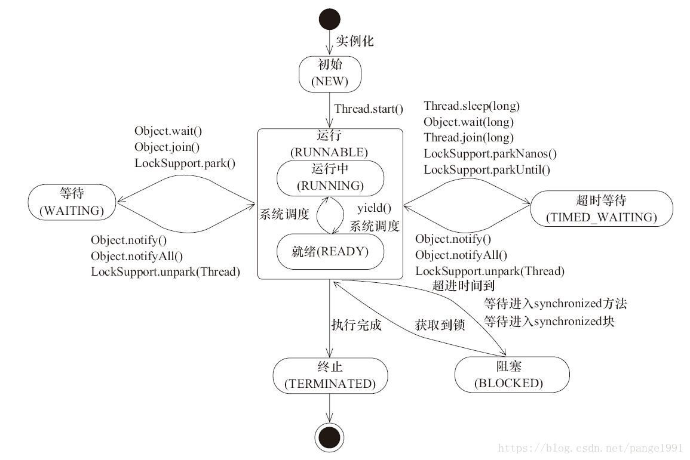

## 基础面试题

```text
1. JVM是什么？ 为什么称Java是“平台无关的编程语言”？
JVM是一个可以执行Java字节码文件的虚拟机进程。
Java源文件被编译成字节码文件。
不同平台有各自的JVM。

2. static关键字是什么？ Java中是否可以覆盖（override）一个private或者static方法？
static修饰类的成员变量或者成员方法后，成员变量或成员方法可以在没有类的实例的情况下访问。
Java中static方法不能被覆盖。
方法覆盖是基于运行时动态绑定的，而static方法时编译时静态绑定的。
static方法跟类的任何实例都不相关，但是类的实例可以调用static方法。

3. 是否可以在static环境中访问非static变量？
static变量是类共有的，在所有类的实例中的值都一样。
当类被JVM载入的时候，会对static变量进行初始化。
如果不用实例来访问非static的变量，编译时期报错，因为这时非static的变量还没被创建出来，没有跟任何实例进行关联。

4. 数据类型有哪些？什么是自动拆装箱？
8种基本数据类型：
byte, short, int, long, 
float, double,
boolean, char

自动装箱：编译器在基本数据类型和对应的包装器类型之间的一个转化。如int转Integer,double转Double。
自动拆箱：自动装箱相反。

5. Overload（重载）和Override（重写）的区别？ Overloaded（重载）的方法是否可以改变返回值的类型？
重载和重写是Java多态的不同表现。
重写是父类与子类间多态性的一种表现，子类方法可以覆盖父类的方法。（有相同的名称和参数和返回值）
重载是一个类中多态性的一种表现，一个类里可以有多个同名的方法。（不同的参数个数或有不同的参数类型，只要求参数不同）
重载只要求参数不同，可以有不同的返回值。

6. Java支持多继承吗？
不支持。
只能继承一个父类。
可以通过实现多个接口的方式来达到多继承的目的。

7. 接口和抽象类的区别？
接口中所有方法都是抽象的，默认修饰符public abstract，可以省略。
抽象类中可以包含不抽象的方法，但是一定要有抽象的方法。

类可以实现多个接口，但是只能继承一个抽象类。

类实现接口时，必须要实现接口里所有的抽象方法。
类继承抽象类时，可以不实现所有的抽象方法，但是这个时候类要声明为抽象类。

抽象类实现接口时，可以不提供接口方法的实现。

接口中的变量默认是public final，抽象类可以包含非final的变量。

接口的方法默认是public的。抽象类的方法可以是private，protected或者是public。

接口是绝对抽象的，不能被实例化。
抽象类也不能被实例化，如果包含main方法的话是可以被调用的。

8. 值传递和引用传递？
值传递，传递的是对象拷贝，对对象的拷贝进行的修改不会影响到原对象。
引用传递，传递的是对象的引用，外部对引用对象所做的改变会反映到对象上。

9. 创建线程有几种方式？
3种方式。
• 继承Thread类
• 实现Runnable接口
• 使用Java提供的Executor框架来创建线程池
实现Runnable接口的情况更加灵活。
使用Executor来创建线程池更加方便使用。推荐使用。

10. 同步方法和同步代码块的区别？
在Java中，每个对象都有一把锁。
线程可以使用synchronized关键字来获取对象上的锁。
synchronized关键字可用在方法上(粗粒度锁：这里的锁对象可以是This)。
synchronized关键字可用代码块级别(细粒度锁：这里的锁对象就是任意对象)。

11. 死锁(deadlock)？
两个线程在互相等待，比如互相等待对方释放自己当前所需要的锁或资源。
死锁例子见下。

12. 确保N个线程访问N个资源同时又不死锁？
多线程时，一种简单避免死锁的方式：指定获取锁的顺序，并强制线程按照指定的顺序获取锁。
如果所有线程都以同样的顺序加锁和释放锁，就不会出现死锁了。

13. 集合类的基本接口有哪些？
- Collection：代表了一组对象，每一个对象都是子元素。
- Set: 不包含重复子元素的Collection。
- List: 有顺序的collection，可以包含重复子元素。
- Map: 键值对的对象，键不重复。

14. 迭代器（Iterator）？
Iterator接口提供很多对集合元素进行迭代的方法。
每一个集合类都有可以返回迭代器实例的迭代方法。
迭代器可以在迭代的过程中删除底层集合的元素。

15. Iterator和ListIterator的区别？
• Iterator可用来遍历Set和List，ListIterator只能用来遍历List。
• Iterator只能前向遍历，ListIterator既可以前向也可以后向。
• ListIterator实现了Iterator接口，并包含其他的功能，比如：增加元素，替换元素，获取前一个和后一个元素的索引，等等。

16. HashMap原理？
需要一个hash函数。
使用hashCode()和equals()方法来向集合/从集合添加和检索元素。
添加元素时，通过hash函数计算key的hash值，然后把键值对存储在集合中合适的索引上。
如果key已经存在，value会被更新成新值。
容量（capacity），负载因子（load factor）和扩容极限（threshold resizing）。

17. HashMap和HashTable区别？
都实现了Map接口。
HashMap允许键和值是null，Hashtable不允许键或值是null。
Hashtable是线程安全的，HashMap不是。
HashMap适合单线程环境，Hashtable适合于多线程。
HashMap提供了可供应用迭代的键的集合，因此，HashMap是快速失败的。
Hashtable提供了对键的列举(Enumeration)。
一般认为Hashtable是一个遗留的类。

18. 数组(Array)和列表(ArrayList)有什么区别？什么时候应该使用Array而不是ArrayList？
• Array可以包含基本类型和对象类型，ArrayList只能包含对象类型。
• Array大小是固定的，ArrayList的大小是动态变化的。
• ArrayList提供了更多的方法和特性，比如：addAll()，removeAll()，iterator()等等。
• 对于基本类型数据，集合使用自动装箱来减少编码工作量。但是，当处理固定大小的基本数据类型的时候，这种方式相对比较慢。

19. ArrayList和LinkedList有什么区别？
都实现了List接口。
ArrayList是基于索引的数据接口实现，底层是数组，可以以O(1)的时间复杂度对元素进行随机访问。
LinkedList的底层是基于链表来存储。那查找元素的时间复杂度是O(n)。
相比较ArrayList，LinkedList的插入，添加，删除操作速度更快，因为当元素被添加到集合任意位置的时候，不需要像数组那样重新计算大小或者是更新索引。
LinkedList比ArrayList更占内存，因为LinkedList为每一个节点存储了两个引用，一个指向前一个元素，一个指向下一个元素。

20. 如何权衡是使用无序的数组还是有序的数组？
有序数组最大的好处在于查找的时间复杂度是O(log n)，而无序数组是O(n)。
有序数组的缺点是插入操作的时间复杂度是O(n)，因为值大的元素需要往后移动来给新元素腾位置。相反，无序数组的插入时间复杂度是常量O(1)。

21. HashSet和TreeSet有什么区别？
HashSet是由一个hash表来实现的，因此，它的元素是无序的。add()，remove()，contains()方法的时间复杂度是O(1)。
TreeSet是由一个树形的结构来实现的，它里面的元素是有序的。因此，add()，remove()，contains()方法的时间复杂度是O(logn)。

22. GC
GC的目的是识别并回收不再使用的对象来释放和重用资源。

23. 如果对象的引用为null，GC是否会立即释放对象占用的内存？
不会立即回收。
在下一个垃圾回收周期中，这个对象将是可被回收的。

24. String是基本数据类型吗？
不是。
java.lang.String是final类。不能继承，不能修改。
为了提高效率，节省空间，尽量用StringBuffer。

25. int和Integer的区别？
原始类型和包装器类型。

26. String和StringBuffer的区别？
都可以储存和操作字符串。
String的字符串不可变。
StringBuffer的字符串可变。

27. ArrayList,Vector, LinkedList的存储性能和特性？
ArrayList和Vector底层都是用数组的来存储元素，都允许直接按索引查找元素。索引数据快而插入数据慢。
Vector由于使用了synchronized方法（线程安全），性能上较ArrayList差。
LinkedList使用了双向链表实现存储。索引数据时需要进行前向或后向遍历。但是插入数据时只需要记录本项的前后项即可，所以插入速度较快。

总结：
List的子类特点
		ArrayList:
			底层数据结构是数组，查询快，增删慢
			线程不安全，效率高
		Vector:
			底层数据结构是数组，查询快，增删慢
			线程安全，效率低
		LinkedList:
			底层数据结构是链表，查询慢，增删快
			线程不安全，效率高

28. Collection 和 Collections的区别？
Collection是集合类的上级接口，继承的接口有List和Set。
Collections是一个集合工具类，提供一系列静态方法实现对各种集合的搜索、排序、线程安全化等操作。

集合的继承体系：
Collection
    |- List
        |- ArrayList
        |- Vector
        |- LinkedList
    |- Set
        |- HashSet
        |- TreeSet
        
29. & 和 &&？
都是逻辑运算符。
&&有短路的特性。

30. final, finally, finalize的区别？
final：可修饰属性，方法和类，分别表示属性不可变，方法不可覆盖，类不可继承。
finally是异常处理语句结构的一部分，表示总是执行。
finalize是Object类的一个方法，在垃圾收集器执行的时候会调用被回收对象的此方法，可以覆盖此方法提供垃圾收集时的其他资源回收，例如关闭文件等。

31. sleep() 和 wait() 有什么区别?
sleep是Thread类的方法。
作用是此线程暂停执行指定时间，给执行机会给其他线程。
不会释放锁。
到时间进入就绪状态。

wait是Object类的方法。
对此对象调用wait方法导致本线程放弃对象锁，进入等待此对象的等待锁定池。
只有针对此对象发出notify方法（或notifyAll）后本线程才进入对象锁定池准备获得对象锁，然后进入运行状态。

32. error和exception有什么区别？
error: 很难恢复的错误，比如OOM(内存溢出)。不可能指望程序能处理这样的情况。
exception：表示一种设计或实现问题。如果程序运行正常，从不会发生的情况。

33. 同步和异步？
如果数据将在线程间共享。例如正在写的数据以后可能被另一个线程读到，或者正在读的数据可能已经被另一个线程写过了，那么这些数据就是共享数据，必须进行同步存取。
当应用程序在对象上调用了一个需要花费很长时间来执行的方法，并且不希望让程序等待方法的返回时，就应该使用异步编程，在很多情况下采用异步途径往往更有效率。

34. GC是什么？为什么要有GC？
Gabage Collection。
进行内存回收。
Java语言没有提供释放已分配内存的显示操作方法。

35. short s1 = 1; s1 = s1 + 1;有什么错？ short s1 = 1; s1 +=1;有什么错？
s1+1 运算结果是int型，需要强制转换类型。
s1 +=1 可以正确编译，+=运算时可自动变换数据类型。

36、Math.round(11.5)？ Math.round(-11.5)？
round方法返回与参数最接近的长整数，参数加1/2后求其floor。
12
-11

37. String s = new String(“xyz”);创建了几个String Object？
2个。
一个是在堆中创建的s。
一个是在字符串常量池中创建的“xyz”。

38. 接口是否可继承接口？抽象类是否可实现(implements)接口？抽象类是否可继承实体类(concrete class)？
接口可以继承接口。
抽象类可以实现(implements)接口。
抽象类可继承实体类，但前提是实体类必须有明确的构造函数。

39. List, Set, Map是否继承自Collection接口？
List，Set是，Map不是。

40. abstract的method是否可能是static？是否可能是native？是否可能是synchronized？
都不能。

41. 是否可以继承String类？
String类是final类，不可以继承。

42. swtich是否能作用在byte上？是否能作用在long上？是否能作用在String上？
switch（expr1）中，expr1是一个整数表达式。
因此，传递给switch 和 case 语句的参数应该是 int、 short、 char 或者byte。
long , string 都不能作用于swtich。
1.7版本之后switch语句支持string类型。

43. try {}里有一个return语句，那么紧跟在这个try后的finally {}里的code会不会被执行，什么时候被执行，在return前还是后？
会执行。
在return前执行（finally中程序一定会被执行，return结束后程序结束，所以肯定在之前执行）。

44. 两个对象值相同(x.equals(y) == true)，但却可有不同的hashcode，对不对？
不对。
有相同的hashcode。（hashcode内部也是根据对象值的来做处理的）。
值相同，hashcode一定相同。
hashcode相同，值不一定相同。

45. 当一个线程进入一个对象的一个synchronized方法后，其它线程是否可进入此对象的其它方法？
不能。
当一个线程进入一个对象的synchronized方法后,其他线程可以进入此对象的非synchronized方法,不能进入synchronized方法,都是同一锁（同步代码块时对象锁可以是任何对象，同步方法时对象锁只能是this对象所以无法访问其他方法）。

46. Singleton的实现？
见后续代码。

47. Java的接口和C++的虚类的相同和不同处？
由于Java不支持多继承，而有可能某个类或对象要使用分别在几个类或对象里面的方法或属性，现有的单继承机制就不能满足要求。
与继承相比，接口有更高的灵活性，因为接口中没有任何实现代码。（面向接口编程，比如golang）
当一个类实现了接口以后，该类要实现接口里面所有的方法和属性，并且接口里面的属性在默认状态下面都是public static,所有方法默认情况下是public。
一个类可以实现多个接口。

48. 异常处理机制？
当JAVA 程序违反了JAVA的语义规则时，JAVA虚拟机就会将发生的错误表示为一个异常。
违反语义规则包括2种情况。
一种是JAVA类库内置的语义检查。例如数组下标越界,会引发IndexOutOfBoundsException;访问null的对象时会引发NullPointerException。
另一种情况就是JAVA允许程序员扩展这种语义检查，程序员可以创建自己的异常，并自由选择在何时用throw关键字引发异常。
所有的异常都是java.lang.Thowable的子类。

49. 垃圾回收的优点和原理。并考虑2种回收机制？
自动垃圾回收机制。
不需要考虑内存管理和内存垃圾回收。
垃圾回收器通常是作为一个单独的低级别的线程运行，不可预知的情况下对内存堆中已经死亡的或者长时间没有使用的对象进行清楚和回收。
程序员不能实时的调用垃圾回收器对某个对象或所有对象进行垃圾回收。
回收机制有分代复制垃圾回收和标记清除算法，增量垃圾回收。（垃圾回收常见的算法）

50. char型变量中能不能存贮一个中文汉字？
能够。
因为java中以unicode编码，一个char占2个字节，所以放一个中文是没问题的。

51. 多线程有几种实现方法,都是什么？同步有几种实现方法,都是什么？
多线程有三种实现方法，分别是继承Thread类与实现Runnable接口，线程池。
同步的实现方面有两种，分别是同步代码块和同步方法。

52. 线程的基本概念、线程的基本状态以及状态之间的关系？
线程指在程序执行过程中，能够执行程序代码的一个执行单位。
每个程序至少都有一个线程，也就是程序本身。
Java中的线程有五种状态分别是：新建、就绪、运行、阻塞、结束。（线程的状态转换）
详情见后面。

53. 简述synchronized和java.util.concurrent.locks.Lock的异同？
主要相同点：
Lock能完成synchronized所实现的所有功能。
主要不同点：
Lock有比synchronized更精确的线程语义和更好的性能。
Lock是一个类，synchronized是一个关键字。
synchronized会自动释放锁，而Lock一定要求程序员手工释放，并且必须在finally中释放。

54. JAVA语言如何进行异常处理？关键字：throws,throw,try,catch,finally分别代表什么意义？在try块中可以抛出异常吗？
Java通过面向对象的方法进行异常处理，把各种不同的异常进行分类，并提供了良好的接口。
在Java中，每个异常都是一个对象，它是Throwable 类或其它子类的实例。
当一个方法出现异常后便抛出一个异常对象，该对象中包含有异常信息，调用这个对象的方法可以捕获到这个异常并进行处理。
Java的异常处理是通过5 个关键词来实现的：try、catch、throw、throws和finally。
一般情况下是用try来执行一段程序，如果出现异常，系统会抛出（throws）一个异常，这时候你可以通过它的类型来捕捉（catch）它，或最后（finally）由缺省处理器来处理。
用try来指定一块预防所有”异常”的程序。
紧跟在try程序后面，应包含一个catch子句来指定你想要捕捉的”异常”的类型。
throw语句用来明确地抛出一个”异常”。
throws用来标明一个成员函数可能抛出的各种”异常”。
Finally为确保一段代码不管发生什么”异常”都被执行一段代码。
可以在一个成员函数调用的外面写一个try语句，在这个成员函数内部写另一个try语句保护其他代码。每当遇到一个try语句，”异常”的框架就放到堆栈上面，直到所有的try语句都完成。如果下一级的try语句没有对某种”异常”进行处理，堆栈就会展开，直到遇到有处理这种”异常”的try语句。（异常嵌套）

55. 一个”.java“源文件中是否可以包括多个类（不是内部类）？有什么限制？
可以。
必须只有一个类名与文件名相同。

56. java中有几种类型的流？JDK为每种类型的流提供了一些抽象类以供继承，请说出他们分别是哪些类？
字节流，字符流。
字节流继承于InputStream \ OutputStream。
字符流继承于InputStreamReader \ OutputStreamWriter。
在java.io包中还有许多其他的流，主要是为了提高性能和使用方便。

57. java中会存在内存泄漏吗？请简单描述。
会。
不用的对象一直无法被垃圾回收，就是内存泄漏。
如：int i,i2; return (i-i2); //when i为足够大的正数,i2为足够大的负数。结果会造成溢位，导致错误。（感觉是错的）

58. java中实现多态的机制是什么？
方法的重写Overriding和重载Overloading是Java多态性的不同表现。
重写Overriding是父类与子类之间多态性的一种表现。
重载Overloading是一个类中多态性的一种表现。

59. 垃圾回收器的基本原理是什么？垃圾回收器可以马上回收内存吗？有什么办法主动通知虚拟机进行垃圾回收？
对于GC来说，当程序员创建对象时，GC就开始监控这个对象的地址、大小以及使用情况。
通常，GC采用有向图的方式记录和管理堆(heap)中的所有对象。通过这种方式确定哪些对象是”可达的”，哪些对象是”不可达的”。当GC确定一些对象为”不可达”时，GC就有责任回收这些内存空间。（可达性算法）
可以。程序员可以手动执行System.gc()，通知GC运行，但是Java语言规范并不保证GC一定会执行。

60. 什么是java序列化？如何实现java序列化？
序列化：
就是一种用来处理对象流的机制，所谓对象流也就是将对象的内容进行流化。
可以对流化后的对象进行读写操作，也可将流化后的对象传输于网络之间。
序列化是为了解决在对对象流进行读写操作时所引发的问题。

序列化的实现：
将需要被序列化的类实现Serializable接口。
该接口没有需要实现的方法。
implements Serializable只是为了标注该对象是可被序列化的。
然后使用一个输出流(如：FileOutputStream)来构造一个ObjectOutputStream(对象流)对象，接着，使用ObjectOutputStream对象的writeObject(Object obj)方法就可以将参数为obj的对象写出(即保存其状态)，要恢复的话则用输入流。
详情见序列化和反序列化。


61、是否可以从一个static方法内部发出对非static方法的调用？
不可以,如果其中包含对象的method()；不能保证对象初始化.

62. List、Map、Set三个接口，存取元素时，各有什么特点？
List 以特定次序来持有元素，可有重复元素。
Set 无法拥有重复元素,内部排序。
Map 保存key-value值，value可多值。

63. 使用final关键字修饰一个变量时，是引用不能变，还是引用的对象不能变？
使用final关键字修饰一个变量时，是指引用变量不能变，引用变量所指向的对象中的内容还是可以改变的。例如，对于如下语句：
final StringBuffer a = new StringBuffer(“immutable”);
执行如下语句将报告编译期错误：
a=new StringBuffer("");
但是，执行如下语句则可以通过编译：
a.append(" broken!");

有人在定义方法的参数时，可能想采用如下形式来阻止方法内部修改传进来的参数对象：
public void method(final StringBuffer param) {
    // 
}
实际上，这是办不到的，在该方法内部仍然可以增加如下代码来修改参数对象：
param.append(“a”);

65. 请说出作用域public，private，protected，以及不写时的区别？
作用域      当前类  同一package  子孙类  其他package
public      √           √         √         √
protected   √           √         √         ×
friendly    √           √         ×         ×
private     √           ×         ×         ×

备注：只要记住了有4种访问权限，4个访问范围，61、是否可以从一个static方法内部发出对非static方法的调用？
不可以,如果其中包含对象的method()；不能保证对象初始化.

62、List、Map、Set三个接口，存取元素时，各有什么特点？
List 以特定次序来持有元素，可有重复元素。
Set 无法拥有重复元素,内部排序。
Map 保存key-value值，value可多值。

63、使用final关键字修饰一个变量时，是引用不能变，还是引用的对象不能变？
使用final关键字修饰一个变量时，是指引用变量不能变，引用变量所指向的对象中的内容还是可以改变的。例如，对于如下语句：
final StringBuffer a=new StringBuffer(“immutable”);
执行如下语句将报告编译期错误：
a=new StringBuffer("");
但是，执行如下语句则可以通过编译：
a.append(" broken!");

有人在定义方法的参数时，可能想采用如下形式来阻止方法内部修改传进来的参数对象：
public void method(final StringBuffer param)
{
}
实际上，这是办不到的，在该方法内部仍然可以增加如下代码来修改参数对象：
param.append(“a”);

65、请说出作用域public，private，protected，以及不写时的区别？
这四个作用域的可见范围如下表所示。
说明：如果在修饰的元素上面没有写任何访问修饰符，则表示friendly。

作用域 当前类 同一package 子孙类 其他package
public √ √ √ √
protected √ √ √ ×
friendly √ √ × ×
private √ × × ×

66. 线程如何同步和通讯？
线程同步
什么是线程同步？
当使用多个线程来访问同一个数据时，非常容易出现线程安全问题(比如多个线程都在操作同一数据导致数据不一致),所以我们用同步机制来解决这些问题。

实现同步机制有两个方法：
1。同步代码块：
synchronized(同一个数据){} 同一个数据：就是N条线程同时访问一个数据。
2。同步方法：
public synchronized 数据返回类型 方法名(){}
就是使用 synchronized 来修饰某个方法，则该方法称为同步方法。对于同步方法而言，无需显示指定同步监视器，同步方法的同步监视器是 this 也就是该对象的本身（这里指的对象本身有点含糊，其实就是调用该同步方法的对象）通过使用同步方法，可非常方便的将某类变成线程安全的类。

线程通讯：
为什么要使用线程通讯？

当使用synchronized 来修饰某个共享资源时(分同步代码块和同步方法两种情况）,当某个线程获得共享资源的锁后就可以执行相应的代码段，直到该线程运行完该代码段后才释放对该 共享资源的锁，让其他线程有机会执行对该共享资源的修改。当某个线程占有某个共享资源的锁时，如果另外一个线程也想获得这把锁运行就需要使用wait() 和notify()/notifyAll()方法来进行线程通讯了。

只有多个synchronized代码块使用的是同一个监视器对象，这些synchronized代码块之间才具有线程互斥的效果。
假如a代码块用obj1作为监视器对象，假如b代码块用obj2作为监视器对象，那么，两个并发的线程可以同时分别进入这两个代码块中。

67. String s = “Hello”;s = s + " world!";这两行代码执行后，原始的String对象中的内容到底变了没有？
没有。
因为String被设计成不可变(immutable)类，所以它的所有对象都是不可变对象。
在这段代码中，s原先指向一个String对象，内容是 “Hello”，然后我们对s进行了+操作，那么s所指向的那个对象是否发生了改变呢？答案是没有。这时，s不指向原来那个对象了，而指向了另一个 String对象，内容为"Hello world!"，原来那个对象还存在于内存之中，只是s这个引用变量不再指向它了。

68. String 和StringBuffer的区别？
String和StringBuffer，它们可以储存和操作字符串，即包含多个字符的字符数据。
String类表示内容不可改变的字符串。
而StringBuffer类表示内容可以被修改的字符串。
当你知道字符数据要改变的时候你就可以使用StringBuffer。
典型地，你可以使用StringBuffers来动态构造字符数据。
另外，String实现了equals方法，new String(“abc”).equals(new String(“abc”)的结果为true,而StringBuffer没有实现equals方法，所以，new StringBuffer(“abc”).equals(new StringBuffer(“abc”)的结果为false。

69. StringBuffer与StringBuilder的区别？
StringBuffer和StringBuilder类都表示内容可以被修改的字符串。
StringBuilder是线程不安全的，运行效率高，如果一个字符串变量是在方法里面定义，这种情况只可能有一个线程访问它，不存在不安全的因素了，则用StringBuilder。
如果要在类里面定义成员变量，并且这个类的实例对象会在多线程环境下使用，那么最好用StringBuffer。

70. 数组有没有length()这个方法? String有没有length()这个方法？
数组没有length()这个方法，有length的属性。
String有length()这个方法。

71. 下面的程序代码输出的结果是多少？
public class smallT{
	public static void  main(String args[]) {
		smallT t = new smallT();
		int b = t.get();
		System.out.println(b);
	}
	
	public int get() {
		try {
			return 1 ;
		}
		finally {
			return 2 ;
		}
	}
}

// 返回的结果是2。

72. 设计4个线程，其中两个线程每次对j增加1，另外两个线程对j每次减少1。写出程序？
以下程序使用内部类实现线程，对j增减的时候没有考虑顺序问题。 
public class ThreadTest1 
{ 
private int j; 
    public static void main(String args[]){ 
        ThreadTest1 tt = new ThreadTest1(); 
        Inc inc = tt.new Inc(); 
        Dec dec = tt.new Dec(); 
        for(int i=0;i<2;i++) { 
            Thread t=new Thread(inc); 
            t.start(); 
            t=new Thread(dec); 
            t.start(); 
        } 
    } 
    private synchronized void inc() {  
        j++; 
        System.out.println(Thread.currentThread().getName()+"-inc:"+j); 
    } 
    private synchronized void dec() { 
        j--; 
        System.out.println(Thread.currentThread().getName()+"-dec:"+j); 
    } 
    class Inc implements Runnable{ 
        public void run() { 
            for(int i=0;i<100;i++) { 
                inc(); 
            } 
        } 
    } 
    class Dec implements Runnable{ 
        public void run() { 
            for(int i=0;i<100;i++) { 
                    dec(); 
            }
        }
    }
} 


73. heap和stack有什么区别？
java的内存分为两类，一类是栈内存，一类是堆内存。
栈内存是指程序进入一个方法时，会为这个方法单独分配一块私属存储空间，用于存储这个方法内部的局部变量，当这个方法结束时，分配给这个方法的栈会释放，这个栈中的变量也将随之释放。
堆是与栈作用不同的内存，一般用于存放不放在当前方法栈中的那些数据，例如，使用new创建的对象都放在堆里，所以，它不会随方法的结束而消失。方法中的局部变量使用final修饰后，放在堆中，而不是栈中。

74. 写一单实例类要求精简、清晰？
// 懒汉模式
public class Singleton {
    private static Singleton instance;
    private Singleton() {}

    public static Singleton getInstance() {
        if (instance == null) {
            instance = new Singleton();
        }
        return instance;
    }
}

75. 一列数的规则如下: 1、1、2、3、5、8、13、21、34… 求第30位数是多少， 用递归算法实现？
public class Test {  
  
    public static void main(String[] args) {  
        System.out.println("结果是："+Test.foo(30));  
    }  
  
    /** 
     * 递归算法实现 
     */  
    public static int foo(int i) {  
        if(i<=0)  
            return 0;  
        else if(i>0 && i<=2)  
            return 1;  
        return foo(i-1) + foo(i-2);  
    }  
}


76. final修饰变量值修改的问题？
基本类型：基本类型的值不能发生改变。
引用类型：引用类型的地址值不能发生改变，但是，该对象的堆内存的值是可以改变的。

class Student {
	int age = 10;
}

class FinalTest {
	public static void main(String[] args) {

		// 局部变量是基本数据类型
		int x = 10;
		x = 100;
		System.out.println(x); // 100
		
        final int y = 10;
		//无法为最终变量y分配值
		//y = 100; // 编译报错
		System.out.println(y); // 10
		System.out.println("--------------");
		
		//局部变量是引用数据类型
		Student s = new Student();
		System.out.println(s.age); // 10
		s.age = 100;
		System.out.println(s.age); // 100
		System.out.println("--------------");
		
		final Student ss = new Student();
		System.out.println(ss.age); // 10
		ss.age = 100;
		System.out.println(ss.age); // 100
		
		//重新分配内存空间
		//无法为最终变量ss分配值
		ss = new Student(); // 编译报错
	}
}

77. 多态中成员访问的特点？
/*
	多态：同一个对象(事物)，在不同时刻体现出来的不同状态。
	举例：
		猫是猫，猫是动物。
		水(液体，固体，气态)。
		
多态的前提：
A:要有继承关系。
B:要有方法重写。
C:要有父类引用指向子类对象。
  父 f =  new 子();
			
多态中的成员访问特点：
A:成员变量
    编译看左边，运行看左边。
B:构造方法
    创建子类对象的时候，访问父类的构造方法，对父类的数据进行初始化。
C:成员方法
    编译看左边，运行看右边。
D:静态方法
    编译看左边，运行看左边。
    (静态和类相关，算不上重写，所以，访问还是左边的
    由于成员方法存在方法重写，所以它运行看右边。
*/
class Fu {
	public int num = 100;

	public void show() {
		System.out.println("show Fu");
	}
	
	public static void function() {
		System.out.println("function Fu");
	}
}

class Zi extends Fu {
	public int num = 1000;
	public int num2 = 200;

	public void show() {
		System.out.println("show Zi");
	}
	
	public void method() {
		System.out.println("method zi");
	}
	
	public static void function() {
		System.out.println("function Zi");
	}
}

class DuoTaiDemo {
	public static void main(String[] args) {
		// 要有父类引用指向子类对象。
		// 父 f =  new 子();
		Fu f = new Zi();
		System.out.println(f.num);
		// 找不到符号
		// System.out.println(f.num2);
		
		f.show();
		// 找不到符号
		// f.method();
		f.function();
	}
}


```


```java
// 死锁
public class DeadLockTest {
    private static Object A = new Object(), B = new Object(); // 两个锁对象

    public static void main(String... args) {
        new Thread(() -> {
            System.out.println("线程1开始执行...");
            synchronized (A) {
                try {
                    System.out.println("线程1拿到A锁");
                    //休眠两秒让线程2有时间拿到B锁
                    Thread.sleep(2000);
                } catch (Exception e) {
                    e.printStackTrace();
                }
                synchronized (B) {
                    System.out.println("线程1拿到B锁");
                }
            }
        }).start();
        
        new Thread(() -> {
            System.out.println("线程2开始执行...");
            synchronized (B) {
                try {
                    System.out.println("线程2拿到B锁");
                    //休眠两秒让线程1有时间拿到A锁
                    Thread.sleep(2000);
                } catch (Exception e) {
                    e.printStackTrace();
                }
                synchronized (A) {
                    System.out.println("线程2拿到A锁");
                }
            }
        }).start();
        
    }
}
```

```java
// 单例

// 1. 饿汉式，(线程安全，调用效率高，但是不能延时加载)
// 如果没有使用到这个对象，那么会照成资源浪费
public class Singleton {
    private static Singleton instance = new Singleton();

    private Singleton {}

    public static Singleton getInstance() {
        return instance;
    }
}

// 2. 懒汉式，(线程安全，调用效率不高，但是能延时加载)：
public class Singleton {
     
    //类初始化时，不初始化这个对象(延时加载，真正用的时候再创建)
    private static Singleton instance;
     
    //构造器私有化
    private Singleton() {}
     
    //方法同步，调用效率低
    public static synchronized Singleton getInstance() {
        if(instance==null) {
            instance=new Singleton();
        }
        return instance;
    }
}


// 3.Double CheckLock实现单例：DCL也就是双重锁判断机制（由于JVM底层模型原因，偶尔会出问题，不建议使用）：
public class Singleton {
        private volatile static Singleton instance;
 
        private Singleton() {}
 
        public static Singleton newInstance() {
            if (instance == null) {
                synchronized (Singleton.class) {
                    if (instance == null) {
                        instance = new Singleton();
                    }
                }
            }
            return SingletonDemo5;
        }
}

// 4.静态内部类实现模式（线程安全，调用效率高，可以延时加载）
public class SingletonDemo3 {
     
    private static class SingletonClassInstance {
        private static final SingletonDemo3 instance = new SingletonDemo3();
    }
     
    private SingletonDemo3() {}
     
    public static SingletonDemo3 getInstance() {
        return SingletonClassInstance.instance;
    }
     
}

// 5.枚举类（线程安全，调用效率高，不能延时加载，可以天然的防止反射和反序列化调用）
public enum SingletonDemo4 {
     
    //枚举元素本身就是单例
    INSTANCE;
     
    //添加自己需要的操作
    public void singletonOperation(){     
    }
}

// -单例对象 占用资源少，不需要延时加载，枚举 好于 饿汉
// -单例对象 占用资源多，需要延时加载，静态内部类 好于 懒汉式

// 原理：
// 当一个Java类第一次被真正使用到的时候静态资源被初始化、Java类的加载和初始化过程都是线程安全的。所以，创建一个enum类型是线程安全的。

枚举的源码，枚举是怎么实现的，枚举为何是线程安全的，为什么用枚举实现的单例是最佳方式？
enum就和class一样，只是一个关键字，并不是一个类。
public enum t {
    SPRING,SUMMER,AUTUMN,WINTER；/**枚举的实例对象**/
}
反编译：
public final class T extends Enum {
    private T(String s, int i) {
        super(s, i);
    }
    public static T[] values() {
        T at[];
        int i;
        T at1[];
        System.arraycopy(at = ENUM$VALUES, 0, at1 = new T[i = at.length], 0, i);
        return at1;
    }
    public static T valueOf(String s) {
        return (T)Enum.valueOf(demo/T, s);
    }

    public static final T SPRING;
    public static final T SUMMER;
    public static final T AUTUMN;
    public static final T WINTER;
    private static final T ENUM$VALUES[];
    static {
        SPRING = new T("SPRING", 0);
        SUMMER = new T("SUMMER", 1);
        AUTUMN = new T("AUTUMN", 2);
        WINTER = new T("WINTER", 3);
        ENUM$VALUES = (new T[] {
            SPRING, SUMMER, AUTUMN, WINTER
        });
    }
}

public final class T extends Enum 说明：
该类是继承了Enum类的。
同时final关键字，这个类也是不能被继承的。
当使用enmu来定义一个枚举类型的时候，编译器会自动帮我们创建一个final类型的类继承Enum类,所以枚举类型不能被继承。

枚举类的属性和方法编译后，都被static修饰：
因为static类型的属性会在类被加载之后被初始化。
当一个Java类第一次被真正使用到的时候静态资源被初始化、Java类的加载和初始化过程都是线程安全的。
所以，创建一个enum类型是线程安全的。

一共有七种实现单例的方式。Effective Java作者Josh Bloch 提倡使用枚举的方式。
- 枚举写法简单
public enum EasySingleton{
    INSTANCE;
}
然后就可以通过EasySingleton.INSTANCE来访问。
- 枚举实例创建是thread-safe(线程安全的)
当一个Java类第一次被真正使用到的时候静态资源被初始化、Java类的加载和初始化过程都是线程安全的。所以，创建一个enum类型是线程安全的。
```

线程状态图 
与等待队列相关的步骤和图 
```text
Java中线程的状态分为6种。
1. 初始(NEW)：
新创建了一个线程对象，但还没有调用start()方法。

实现Runnable接口和继承Thread可以得到一个线程类，new一个实例出来，线程就进入了初始状态。

2. 运行(RUNNABLE)：
Java线程中将就绪（ready）和运行中（running）两种状态笼统的称为“运行”。

线程对象创建后，其他线程(比如main线程）调用了该对象的start()方法。该状态的线程位于可运行线程池中，等待被线程调度选中，获取CPU的使用权，此时处于就绪状态（ready）。

就绪状态的线程在获得CPU时间片后变为运行中状态（running）。

3.阻塞(BLOCKED)：
表示线程阻塞于锁。

4.等待(WAITING)：
进入该状态的线程需要等待其他线程做出一些特定动作（通知或中断）。

5.超时等待(TIMED_WAITING)：
该状态不同于WAITING，它可以在指定的时间后自行返回。

6. 终止(TERMINATED)：
表示该线程已经执行完毕。

------------------------------------

1. 初始状态
实现Runnable接口和继承Thread可以得到一个线程类，new一个实例出来，线程就进入了初始状态。

2.1. 就绪状态
- 就绪状态只是说你资格运行，调度程序没有挑选到你，你就永远是就绪状态。
- 调用线程的start()方法，此线程进入就绪状态。
- 当前线程sleep()方法结束，其他线程join()结束，等待用户输入完毕，某个线程拿到对象锁，这些线程也将进入就绪状态。
- 当前线程时间片用完了，调用当前线程的yield()方法，当前线程进入就绪状态。
- 锁池里的线程拿到对象锁后，进入就绪状态。

2.2. 运行中状态
线程调度程序从可运行池中选择一个线程作为当前线程时线程所处的状态。这也是线程进入运行状态的唯一一种方式。

3. 阻塞状态
阻塞状态是线程阻塞在进入synchronized关键字修饰的方法或代码块(获取锁)时的状态。

4. 等待
处于这种状态的线程不会被分配CPU执行时间，它们要等待被显式地唤醒，否则会处于无限期等待的状态。

5. 超时等待
处于这种状态的线程不会被分配CPU执行时间，不过无须无限期等待被其他线程显示地唤醒，在达到一定时间后它们会自动唤醒。

6. 终止状态
- 当线程的run()方法完成时，或者主线程的main()方法完成时，我们就认为它终止了。这个线程对象也许是活的，但是，它已经不是一个单独执行的线程。线程一旦终止了，就不能复生。
- 在一个终止的线程上调用start()方法，会抛出java.lang.IllegalThreadStateException异常。

等待队列
- 调用obj的wait(), notify()方法前，必须获得obj锁，也就是必须写在synchronized(obj) 代码段内。
- 与等待队列相关的步骤和图

1.线程1获取对象A的锁，正在使用对象A。
2.线程1调用对象A的wait()方法。
3.线程1释放对象A的锁，并马上进入等待队列。
4.锁池里面的对象争抢对象A的锁。
5.线程5获得对象A的锁，进入synchronized块，使用对象A。
6.线程5调用对象A的notifyAll()方法，唤醒所有线程，所有线程进入同步队列。若线程5调用对象A的notify()方法，则唤醒一个线程，不知道会唤醒谁，被唤醒的那个线程进入同步队列。
7.notifyAll()方法所在synchronized结束，线程5释放对象A的锁。
8.同步队列的线程争抢对象锁，但线程1什么时候能抢到就不知道了。 

同步队列状态
- 当前线程想调用对象A的同步方法时，发现对象A的锁被别的线程占有，此时当前线程进入同步队列。简言之，同步队列里面放的都是想争夺对象锁的线程。
- 当一个线程1被另外一个线程2唤醒时，1线程进入同步队列，去争夺对象锁。
- 同步队列是在同步的环境下才有的概念，一个对象对应一个同步队列。

几个方法的比较:
1. Thread.sleep(long millis)
一定是当前线程调用此方法，当前线程进入TIMED_WAITING状态，但不释放对象锁，millis后线程自动苏醒进入就绪状态。作用：给其它线程执行机会的最佳方式。

2. Thread.yield()
一定是当前线程调用此方法，当前线程放弃获取的CPU时间片，但不释放锁资源，由运行状态变为就绪状态，让OS再次选择线程。作用：让相同优先级的线程轮流执行，但并不保证一定会轮流执行。实际中无法保证yield()达到让步目的，因为让步的线程还有可能被线程调度程序再次选中。Thread.yield()不会导致阻塞。该方法与sleep()类似，只是不能由用户指定暂停多长时间。

3. t.join()/t.join(long millis)
当前线程里调用其它线程t的join方法，当前线程进入WAITING/TIMED_WAITING状态，当前线程不会释放已经持有的对象锁。线程t执行完毕或者millis时间到，当前线程进入就绪状态。

4. obj.wait()
当前线程调用对象的wait()方法，当前线程释放对象锁，进入等待队列。依靠notify()/notifyAll()唤醒或者wait(long timeout) timeout时间到自动唤醒。

5. obj.notify()
唤醒在此对象监视器上等待的单个线程，选择是任意性的。notifyAll()唤醒在此对象监视器上等待的所有线程。
```